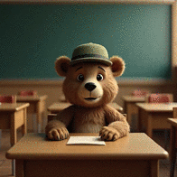
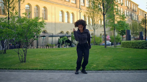
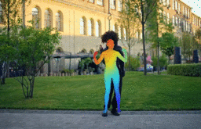

# Uni3C
[Preprint] Uni3C: Unifying Precisely 3D-Enhanced Camera and Human Motion Controls for Video Generation

<a href='https://arxiv.org/abs/2504.14899'>
</a> 
<a href='https://ewrfcas.github.io/Uni3C/'>
</a> 

## News
- **2025-05-28**: We updated codes of alignment for human pose and world point clouds.
- **2025-05-27**: We support FSDP and sequential parallel inference with multiple GPUs (`pip install xfuser[flash-attn]`).
- **2025-05-22**: Release [model weights](https://huggingface.co/ewrfcas/Uni3C/tree/main) and [OOD benchmark](https://huggingface.co/datasets/ewrfcas/Uni3C) of PCDController.
- **2025-05-21**: Release inference code of PCDController.

## TODO List
- [x] Camera control inference code
- [x] Model weights
- [x] Validation benchmark
- [x] FSDP + Sequential parallel
- [x] HumanPose-WorldPointClouds alignment
- [ ] Unified control inference code

## Setup

```
# setup for camera control
git clone https://github.com/ewrfcas/Uni3C.git
cd Uni3C

apt-get update && apt-get install tmux ffmpeg libsm6 libxext6 libglm-dev -y
conda create -n uni3c python=3.10
conda activate uni3c

pip install -r requirements.txt
pip install carvekit --no-deps

# install pytorch3d
git clone https://github.com/facebookresearch/pytorch3d.git
cd pytorch3d && pip install -e .

# setup for alignment
cd third_party/GVHMR_realisdance
bash install.sh
cd ../GeoCalib && pip install -e .
cd ../..
```

## Camera control inference

### Stage 1. Rendering pointclouds and video

There are 7 parameters to control the camera in free.

Rotation parameters:
- `d_r`: Distance from the camera to the foreground center, default is 1.0, range 0.25 to 2.5.
- `d_theta`: Rotated elevation degrees, <0 up, >0 down, range -90 to 30.
- `d_phi`: Rotated azimuth degrees, <0 right, >0 left, supports 360 degrees; range -360 to 360.

Offset parameters:
- `x_offset`: Horizontal translation, <0 left, >0 right, range -0.5 to 0.5; depends on depth.
- `y_offset`: Vertical translation, <0 up, >0 down, range -0.5 to 0.5; depends on depth.
- `z_offset`: Forward and backward translation, <0 back, >0 forward, range -0.5 to 0.5 is ok; depends on depth.

Intrinsic parameters:
- `focal_length`: Focal length, range 0.25 to 2.5; changing focal length zooms in and out.

We also support `traj_type` to define camera trajectories: `"custom", "free1", "free2", "free3", "free4", "free5", "swing1", "swing2", "orbit"`.
`"custom"` is used to control along a custom trajectory with parameters mentioned above, while others support for pre-defined camera trajectories.


We recommend to read [ViewCrafter](https://github.com/Drexubery/ViewCrafter/blob/main/docs/gradio_tutorial.md) for more detailed hyper-parameter introduction about the camera control

```
python cam_render.py --reference_image "data/demo/flux-0.png" \
                     --output_path "outputs/demo_0" \
                     --traj_type "custom" \
                     --x_offset 0.25 \
                     --d_phi -50.0
                     
python cam_render.py --reference_image "data/demo/flux-1.png" \
                     --output_path "outputs/demo_1" \
                     --traj_type "free1"
```

### Stage 2. Generating by PCDController

Simply run commands as below, model weights would be downloaded from huggingface automatically. `render_path` is the outcome of `reference_image` from stage1. 

```
CUDA_VISIBLE_DEVICES=0 python cam_control.py \
                      --reference_image "data/demo/flux-0.png" \
                      --render_path "outputs/demo_0" \
                      --output_path "outputs/demo_0/result.mp4" \
                      --prompt "The video features a cartoonish bear sitting at a school desk in a classroom setting."
                      
                      
CUDA_VISIBLE_DEVICES=0 python cam_control.py \
                      --reference_image "data/demo/flux-1.png" \
                      --render_path "outputs/demo_1" \
                      --output_path "outputs/demo_1/result.mp4" \
                      --prompt "The video features a living room."
                      
# for faster FSDP + Sequential parallel inference with 4 GPUs
CUDA_VISIBLE_DEVICES=0,1,2,3 torchrun --nproc_per_node=4 cam_control.py \
                      --reference_image "data/demo/flux-0.png" \
                      --render_path "outputs/demo_0" \
                      --output_path "outputs/demo_0/result_sp.mp4" \
                      --prompt "The video features a cartoonish bear sitting at a school desk in a classroom setting." \
                      --enable_sp \
                      --fsdp
```

You should achieve results as below:

| Reference                                     | Render (stage1)                         | Result (stage2)                         |
|-----------------------------------------------|-----------------------------------------|-----------------------------------------|
|  |  |  |

### Efficiency comparison
| Methods                       | GPU memory (GB) | Time (min) |
|-------------------------------|-----------------|------------|
| H20*1 + offload               | 50.8*1          | ~20.0      |
| H20*4 + SP + offload          | 53.7*4          | ~15.0      |
| H20*4 + SP + FSDP (recommend) | 46.1*4          | <5.0       |

## Human pose & Alignment

Run these codes for the alignment. Camera parameters are detailed above.

```
# run for pose extraction (ensure you are in the path of 'third_party/GVHMR_realisdance')
cd third_party/GVHMR_realisdance
python extract_pose.py --video "../../data/demo_uni3c/video.mp4" \
                       --output_root "../../outputs/demo_uni3c"
                       
# back to the main path (Uni3C)                      
cd ../.. 

python alignment.py --input_image "data/demo_uni3c/reference.png" \
                    --input_path "outputs/demo_uni3c" \
                    --output_path "outputs/demo_uni3c_aligned" \
                    --traj_type "free1"
```

You should achieve results as below:

| Reference image                                | Target video                                     | Aligned video                                     |
|------------------------------------------------|--------------------------------------------------|---------------------------------------------------|
|  |  |  |

### Benchmark

You could download validation images and prompts from this [link](https://huggingface.co/datasets/ewrfcas/Uni3C).

## Cite
If you found our project helpful, please consider citing:

```
@article{cao2025uni3c,
        title={Uni3C: Unifying Precisely 3D-Enhanced Camera and Human Motion Controls for Video Generation},
        author={Cao, Chenjie and Zhou, Jingkai and Li, shikai and Liang, Jingyun and Yu, Chaohui and Wang, Fan and Xue, Xiangyang and Fu, Yanwei},
        journal={arXiv preprint arXiv:2504.14899},
        year={2025}}
```

## Acknowledgements
Our codes are built upon [RealisDance-DiT](https://github.com/damo-cv/RealisDance), [Depth-Pro](https://github.com/apple/ml-depth-pro), [ViewCrafter](https://github.com/Drexubery/ViewCrafter), [GVHMR](https://github.com/zju3dv/GVHMR), [GeoCalib](https://github.com/cvg/GeoCalib), [Wan2.1](https://github.com/Wan-Video/Wan2.1) and [diffusers](https://github.com/huggingface/diffusers).
